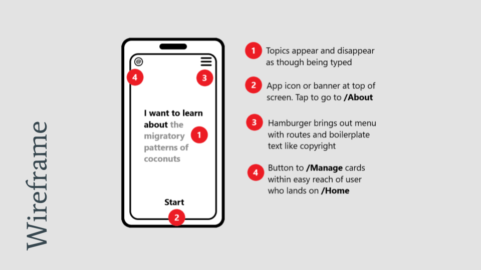
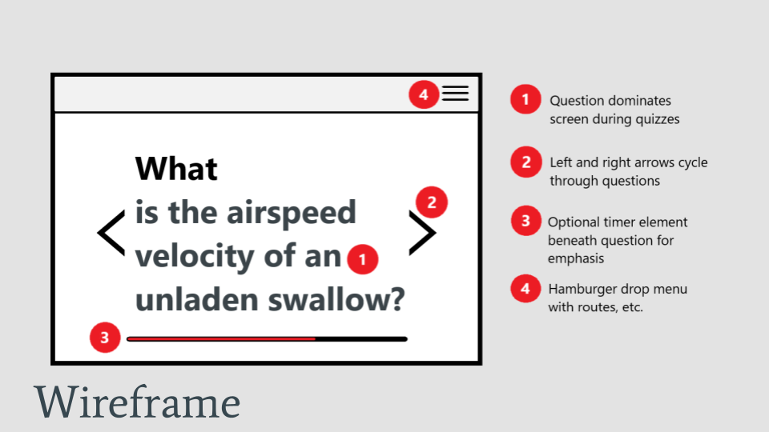
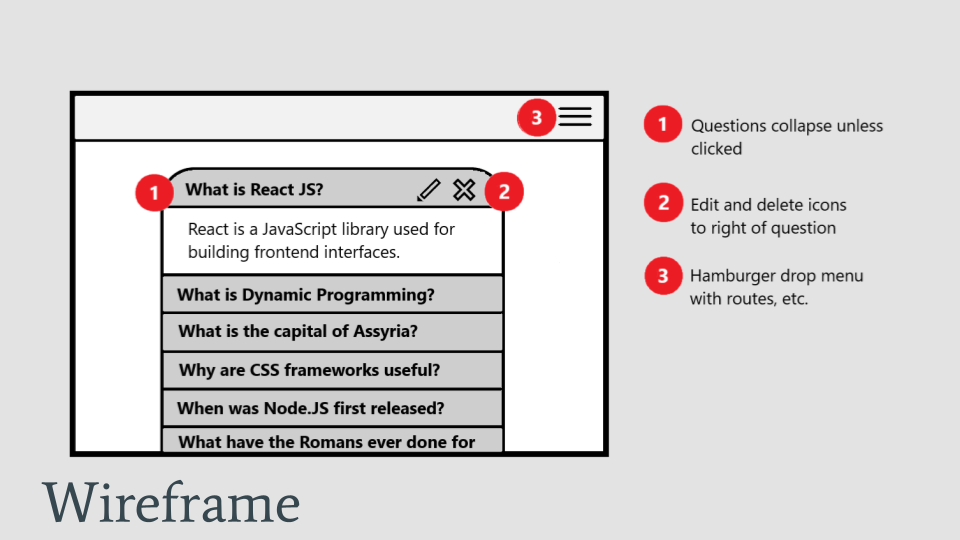

# cs465p-project

My final project for _CS 465p: Full Stack Development_ implements a simple flashcard app to assist with learning retention. The app uses an embedded SQLite database to manage flashcards, with views handled by Pug (Jade) and Sequelize serving as an ODM. My hope is that I'll be able to implement timed features so that flashcards can be served over progressively longer intervals of time.

 

## Roadmap

□ Convert [MDN Express tutorial](https://developer.mozilla.org/en-US/docs/Learn_web_development/Extensions/Server-side/Express_Nodejs/Tutorial_local_library_website) to use an embedded database like SQLite instead of MongoDB.

□ Change underlying models to best suit flashcards: `question`, `answer`, possibly `img` if a flashcard uses media.

□ Rework site-wide template and CSS to something approaching original wireframes. At least three were planned:

<figure style="margin: 20px 0;">
  

    
  

  <figcaption align="center"><em>Mobile home screen wireframe</em></figcaption>
</figure>

<figure style="margin: 20px 0;">
  

    
  

  <figcaption align="center"><em>Mobile home screen wireframe</em></figcaption>
</figure>

<figure style="margin: 20px 0;">
  

    
  

  <figcaption align="center"><em>Mobile home screen wireframe</em></figcaption>
</figure>

 

## Possible Additional Features

- Spaced repitition over longer intervals, with option to pause or change intervals

- Multiple Choice Cards (automatically use pause/change interval on correct/incorrect input)

- Add timed response questions

- Any other ideas?
