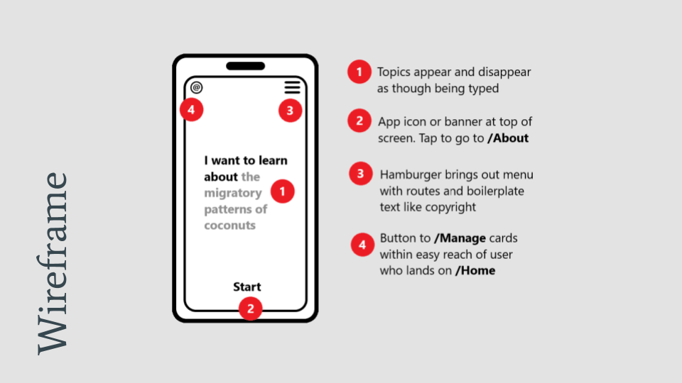
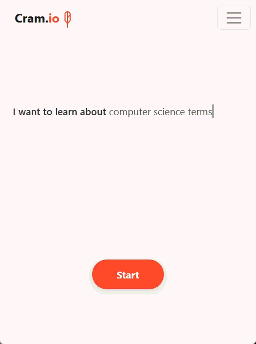
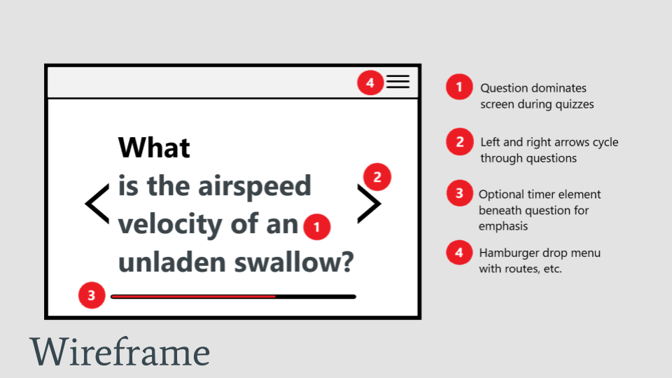
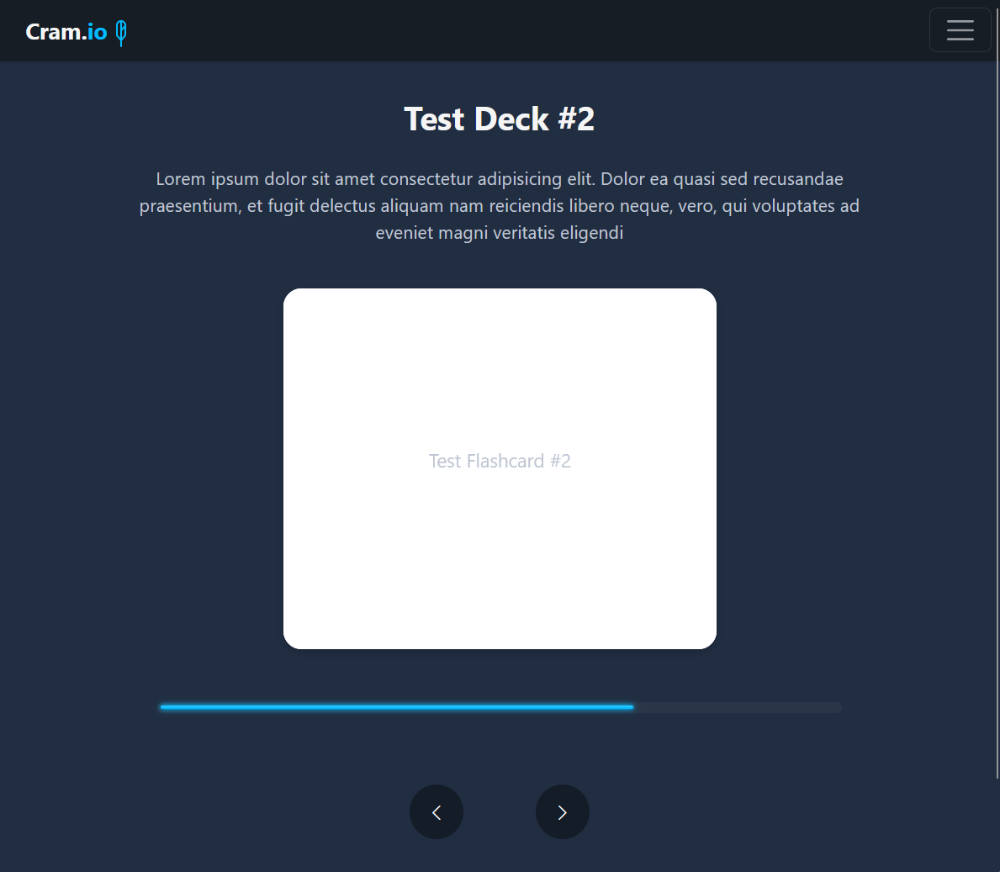
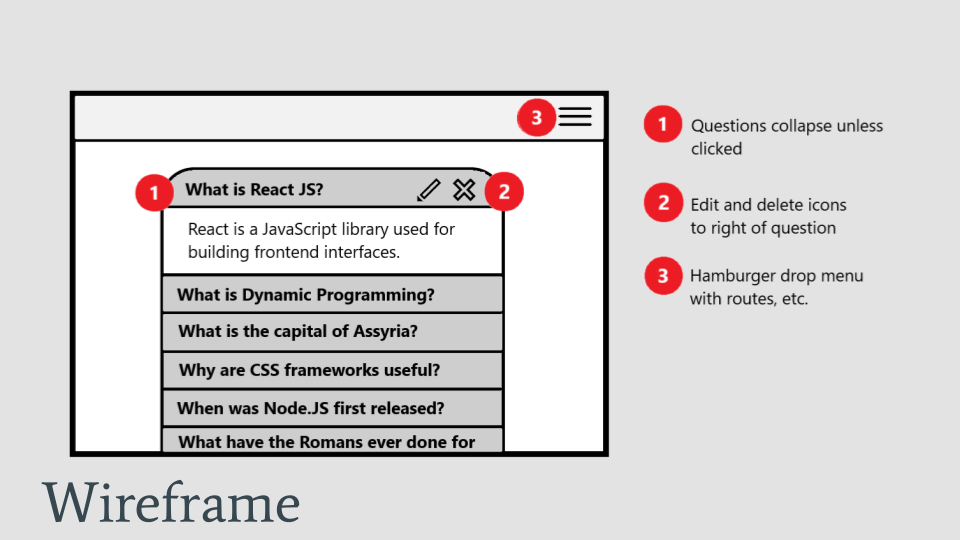
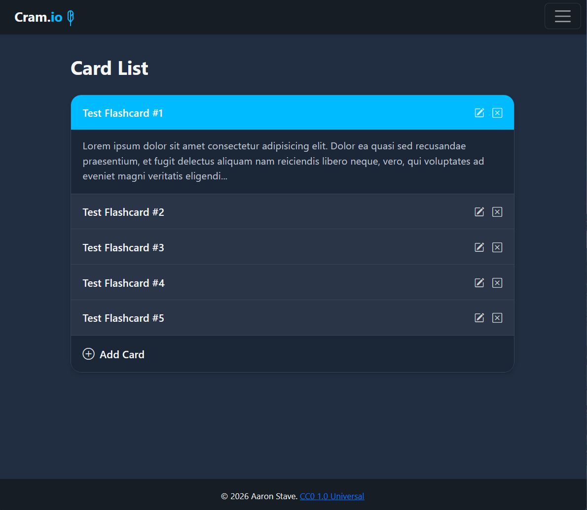

# cs465p-project

My final project for _CS 465p: Full Stack Development_ implements a simple flashcard app to assist with learning retention. The app uses an embedded SQLite database to manage flashcards, with views handled by Pug (Jade) and Sequelize serving as an ODM. My hope is that I'll be able to implement timed features so that flashcards can be served over progressively longer intervals of time. Flashcards and Multiple-Choice Questions (MCQs) can be commingled and shared across decks. Items can be renamed or deleted from their respective management pages. You can play a deck from the deck management page. When playing you can flip through all the cards; each card has a 5 second timer before the answer is revealed, so be fast!

 

## How to Run

_Updated 3/21/26_

1. On the command line enter `npm install` and `npm audit fix` to install and update dependencies

2. Enter `npm start` to start up the server in normal configuration. Use `npm dev` to enable hot reload if you're making code changes and `npm server` to run the server with console logs enabled.

3. In your preferred web browser, navigate to `http://localhost:3000` to start using the site.

 

## Roadmap

✓ Convert [MDN Express tutorial](https://developer.mozilla.org/en-US/docs/Learn_web_development/Extensions/Server-side/Express_Nodejs/Tutorial_local_library_website) to use an embedded database like SQLite instead of MongoDB.

✓ Change underlying models to best suit flashcards: `question`, `answer`, possibly `img` if a flashcard uses media.

✓ Rework site-wide template and CSS to something approaching original wireframes. At least three were planned:

□ Extend cards to use variable timers instead of a flat 5 second timer for all cards. Timers can be set individually by users at card creation.

□ Extend backend to track successive correct/incorrect attempts for each card: This will allow us to implement spaced repition mechanics down the line.

□ Automate timers to scale individual timers according to correct/incorrect streaks.

□ Consider alternative to Express+SQLite: If it's a standalone utility we shouldn't have to run server and navigate to localhost; if it's a platform we need to find a host and swap SQLite for something else, plus implement account mechanics.

 

## Screenshots

I've taken a few screenshots in both light- and dark-theme so you can see how the final version reflects the wireframes I started with!

<figure style="margin: 20px 0;">
  

    
  

  <figcaption align="center"><em>Mobile home screen wireframe</em></figcaption>
</figure>
<figure style="margin: 20px 0;">
  

    
  

  <figcaption align="center"><em>Mobile home screen (final)</em></figcaption>
</figure>

<figure style="margin: 20px 0;">
  

    
  

  <figcaption align="center"><em>Mobile home screen wireframe</em></figcaption>
</figure>
<figure style="margin: 20px 0;">
  

    
  

  <figcaption align="center"><em>Mobile home screen (final)</em></figcaption>
</figure>

<figure style="margin: 20px 0;">
  

    
  

  <figcaption align="center"><em>Mobile home screen wireframe</em></figcaption>
</figure>
<figure style="margin: 20px 0;">
  

    
  

  <figcaption align="center"><em>Mobile home screen (final)</em></figcaption>
</figure>

 

## Possible Additional Features

- Any other ideas?
